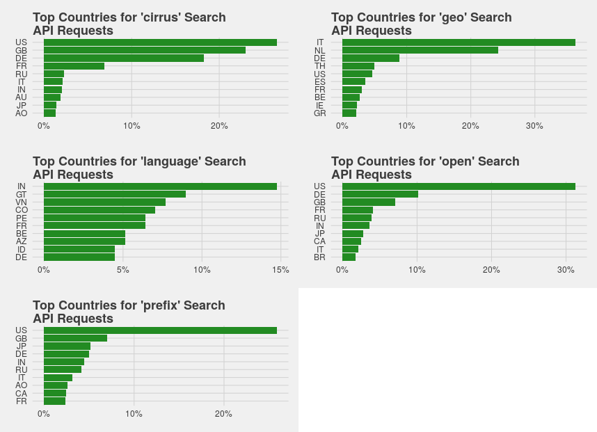

# Background

Every week, our search APIs process around 950m requests from all over the globe - but we know relatively little about what these requests
look like, who's sending them, or where they come from.

This project is to gather very basic information about the APIs in use and how, exactly, people are using them. We have five types of search-related API query; these are:

1. *OpenSearch* queries, which handles full-text searches;
2. *Cirrus* queries, another form of full-text;
3. *prefix* queries, which matches based on the characters of the search string matching the prefix of the page title;
4. *geo* queries, which search for geographic information, and;
5. *language* queries, which search for language-based information.

We will analyse each type of query in turn.

# Methodology

Four random hour/day combinations were picked from August 2015; these were:

Day           Hour
-------       -------
3 August      07:00 - 08:00
6 August      14:00 - 15:00
12 August     22:00 - 23:00
16 August     04:00 - 05:00

For each combination, we looked at the Wikimedia access logs for that time period and used [pre-existing User Defined Functions (UDFs)](
https://github.com/wikimedia/analytics-refinery-source/blob/master/refinery-hive/src/main/java/org/wikimedia/analytics/refinery/hive/SearchClassifierUDF.java) to identify queries that fell into one of these buckets. Each set was then extracted and analysed, resulting in a set of metrics being generated for each class of query in turn.

# Results

The results cover 22m queries over 4 day/hour combinations and 5 types of search request. Not all types of search request appear in all
pieces of analysis because some are so rarely used they simply don't have enough data.

## Usage

```{r, echo=FALSE}
library(ggplot2)
library(ggthemes)
options(scipen = 500)
source("functions.R")
suppressMessages({use_info()})
```

As we can see the vast number of API requests (Fig. 1) are for full-text search - *open* and *cirrus* search - followed by prefix search. Almost
nobody uses geographic search, or language search; in fact, in the 4 hours analysed, only 156 language search requests appeared across
all sites.

## Geographic Distribution

```{r, echo=FALSE, message=FALSE}
suppressMessages({
  library(data.table)
  library(scales)
  library(gridExtra)
  top_country_info()
})
```


If we look at the top 10 countries for each class of request (Fig. 2) we see some variation. Based on hand-coding of the results, this is due to a mix of automated activity in some cases, and low request volumes (which make the proportions very easy to vary) in others. Generally-speaking, search requests tend to follow a North American/European bias in the same way that pageviews do.

## API Methods

```{r, echo=FALSE, message=FALSE}
suppressMessages({
  format_info()
})
```

The requested data formats are important to identify how clients would best like to retrieve information and, by extension, what
we should prioritise support for. The data around this (Fig. 3) shows that JSON is (with the exception of the tiny number of geographic API hits) consistently the preferred data format, followed by XML. Almost nobody asks for text or serialised PHP-based datasets.

# Conclusion

While this is only a very high-level look at the use of our API, a few interesting things can be picked out. These are:

1. The vast majority of searches are full-text, followed by prefix; the geographic and language search features receive almost no use;
2. The geographic distribution of searches is roughly the same as the geographic distribution of pageviews, albeit with more common automata-based distortion;
3. Serialised PHP and text-based output formats are almost never used.
